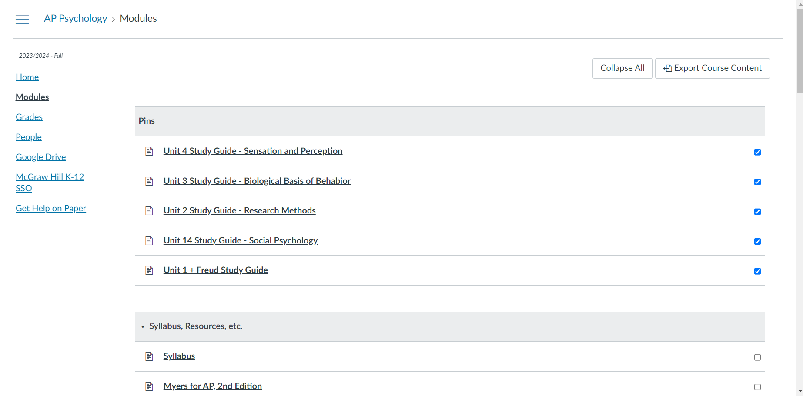

# Canvas Pins Chrome Extension

This Chrome extension allows you to pin Canvas module items to their own special module at the top of the screen!

Demo:

## Installation instructions
- Download this repository as a [ZIP](https://codeload.github.com/eliskol/canvas-pins/zip/refs/heads/main)
- Unzip the files to a folder
- Go to chrome://extensions
- Enable developer mode
- Click "Load unpacked"
- Select the folder that you unzipped to
- Start pinning module items!